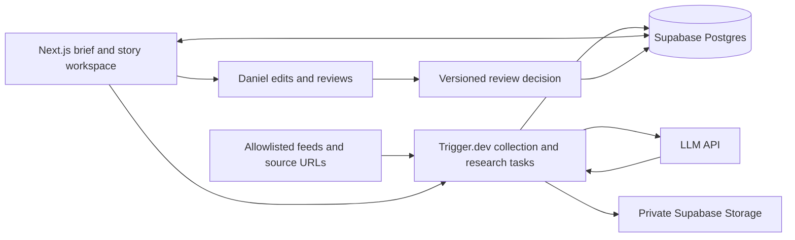

# Content OS strategy and V0 architecture

Design date: September 30, 2026. Status: proposed architecture only. No application code, infrastructure provisioning, or subscriptions authorized by this document.

Build a private editorial workspace for Daniel Rodriguez’s applied-AI brand. The first milestone is simple: **opening the morning brief should be more useful than manually checking AI news.**

The recommended V0 is one Next.js application, Supabase for persistent records, and a thin Trigger.dev job layer. Use one LLM provider for bounded research and drafting tasks. Human judgment remains the final step. Google Drive enters only when large media files justify it.

## Project instructions

### Long-term concept

The system may eventually ingest AI news and releases; deduplicate and rank stories; preserve primary-source evidence; collect real visual assets with provenance and usage metadata; monitor competitors; suggest angles; draft scripts, posts and newsletters; remember approved tone and opinions; ingest and transcribe recorded videos; create rough edits and branded graphics; present everything for human review; publish approved content safely; collect analytics; and learn from performance.

These are future possibilities, not V0 requirements.

### V0 scope

**SOURCE → STORY → RESEARCH → ANGLE → DRAFT → REVIEW**

V0 must let Daniel:

1. See candidate AI stories from a small set of high-quality sources.
2. Deduplicate coverage of the same event.
3. Open a story and see its title, source, publication time, extracted claims, evidence URLs, confidence/evidence status, why it matters, and LATAM relevance.
4. Save relevant visual assets with source, publisher, rights/usage status, required attribution, and publishable yes/no.
5. Generate three angles: fast news, analysis/opinion, and practical/build use case.
6. Draft a short-video outline, Instagram/news-card copy, X post, and newsletter note.
7. Review everything personally.
8. Edit, approve, or reject.
9. Preserve approved edits so future versions can learn tone, preferences, and opinions.

No publishing, scheduling posts, video editing, competitor scraping, multi-agent system, community, or advanced analytics. No transcription, graphic renderer, or automated performance learning in V0 either. News-card output is copy and an asset suggestion, not a rendered card.

### Technology and editorial rules

- Evaluate Next.js + TypeScript, Supabase, Trigger.dev, and Google Drive later. Use each only where it earns its complexity.
- Primary sources outrank creator commentary. LLM summaries are not evidence.
- Preserve original URLs and timestamps. Every factual claim must remain traceable to sources.
- Scraped images are not automatically publishable.
- AI may suggest opinions; it cannot invent Daniel’s beliefs or personal experience.
- Human approval is mandatory.
- Prefer APIs, RSS, and feeds over browser automation.
- Minimize recurring costs and use tools already paid for where sensible.
- Keep stable records that later publishing, video, competitor intelligence, and analytics can reference. Do not implement those systems now.
- Codex builds and maintains the software; it is not the production scheduler.

The research baseline and creator profile in the other two files are user-supplied inputs. Their hypotheses and technology candidates are not independently verified September 2026 research. Preserve them as inputs; this document makes the V0 recommendations.

## The smallest useful product

Use two main views and a small settings panel.

| Surface | What Daniel can do |
| --- | --- |
| Morning brief | Scan a ranked list of distinct events; filter new, saved, dismissed, or awaiting review; see why each ranked; open evidence; save a story; paste a source URL. |
| Story workspace | Read research beside source excerpts; inspect assets; generate three angles; choose an angle and draft format; edit; approve or reject; inspect earlier revisions. |
| Settings panel | Enable sources, see fetch failures, edit explicit editorial preferences, and inspect the generation budget. |

The brief shows the ingestion window, last successful refresh, source coverage, and counts of articles versus distinct stories. “17 stories” must mean 17 deduplicated events. It must never imply complete coverage of AI news.

Each card shows the title, primary publisher and link, original publication time, priority and its reason, evidence status, a short “why it matters,” LATAM relevance with its basis, and one suggested angle. Other coverage appears as links; only genuinely independent verification gets called corroboration. A vendor announcement plus two rewritten articles is one underlying source, not three confirmations.

Use Spanish as the default output language and America/Bogota for display. Preserve original-language excerpts and timestamps with their original timezone when available; store normalized UTC values separately. Unknown publication time remains unknown, with discovery time displayed explicitly.

## Technology decisions

| Component | V0 decision | Why and boundary |
| --- | --- | --- |
| Next.js + TypeScript | Use one app and one repository. | Dashboard, server-side reads, authenticated mutations, shared validation types. No separate API service, microservices, or monorepo tooling. |
| Supabase | Use Postgres, Auth, and a small private Storage bucket. | Claims, source relationships, revisions, and review decisions need durable structured records. Reuse Auth and Storage instead of adding providers. No vectors or Realtime initially. |
| Trigger.dev | Use as the only job runner and scheduler. | Scheduled collection and LLM work must finish when the browser closes and survive transient failures. Thin TypeScript tasks avoid building a queue, retry engine, and scheduler ourselves. No agent framework or human-wait workflow. |
| LLM | One API provider, one default model initially. | Structured extraction, relevance explanations, angles, and drafts. Validate output before saving; keep model and prompt versions. Select against a small sample and budget before implementation. |
| Google Drive | Defer. | Small screenshots and evidence excerpts fit the existing storage layer. Drive OAuth, synchronization, and duplicate media ownership add no value to this milestone. |
| App hosting | Use an existing compatible paid host if available. | Vercel is an option, not a requirement. Confirm commercial-use terms, quotas, and actual subscriptions before choosing. No hosting account was inspected for this design. |

A single cron process on an already-operated server could replace Trigger.dev. That is cheaper only if reliable execution, retry, and maintenance are already available. Do not operate a new server or build a custom queue merely to avoid the job service. Verify current vendor limits and pricing at implementation; no free-tier guarantee is assumed here.

Supabase is the source of workflow truth. Trigger.dev executes tasks; it does not own editorial state. Approval is a database decision tied to a specific revision, not a paused process or an instruction to publish.

## Source to research

### Start with six source families

Proposed launch set: official OpenAI announcements, Anthropic announcements, Google DeepMind announcements, Meta AI announcements, Hugging Face first-party releases, and one quality journalism source such as TechCrunch’s AI coverage. For Hugging Face, distinguish organization-authored material from community posts. Journalism provides discovery and context; follow its primary references when accessible.

These are proposed publishers, not verified working feed endpoints. Before enabling each, confirm its official domain, actual feed/API or permitted public-page access, timestamps, and extraction quality. Use a manual URL entry when automation is unavailable. Do not add browser automation or bypass access restrictions to reach six sources.

Proposed initial cadence: one refresh before the morning brief, at 06:30 America/Bogota, plus a rate-limited manual refresh. Fetch only new or changed entries using source cursors and conditional requests where supported. Bound each run and surface backlog rather than silently dropping overflow. Avoid paid news aggregators and broad web crawling initially.

### Deduplicate events, not just links

First collapse exact URL duplicates and identical content, retaining all observed original URLs. Strip tracking parameters for comparison without destroying meaningful URL parameters. Then compare recent items by organization, product/model, version, event type, announcement date, and links to the same primary announcement.

Use an LLM only to assess ambiguous event matches among that bounded candidate set. Merge automatically only when event identity is clear; otherwise offer “possible duplicate.” Daniel can merge or split, with source assignments preserved. A new release, a later pricing change, and a regional rollout are separate events even when they concern the same product. A correction to the original announcement becomes a new source revision and flags dependent research for review.

No embedding database is needed for six source families. Start with URL identity, structured event fields, and text matching in Postgres.

### Preserve evidence before generating prose

Store the source item’s original URL, resolved/canonical URL, publisher, author where available, publication/update timestamps, discovery time, retrieval time, and content hash. Retain the text used for extraction, or permitted excerpts with stable locators and a hash; store fuller snapshots only where retention is permitted. If retention or access is limited, show that limitation explicitly.

Each extracted factual claim links to a specific source revision and supporting excerpt, with a paragraph/section locator. An exact excerpt match proves traceability, not factual truth or entailment. Human review must still assess whether the passage supports the claim. Translations are labeled and retain the original quote.

Use explicit claim statuses rather than an LLM-generated percentage:

| Evidence status | Meaning |
| --- | --- |
| Primary-source statement | An attributable statement appears in an original announcement, documentation, paper, or artifact. A vendor benchmark remains a vendor-reported result. |
| Independently supported | An independent source directly supports this specific claim; repeated reporting does not qualify. |
| Secondary report only | Available support comes from reporting; the underlying source is missing or inaccessible. |
| Unresolved or conflicting | Support is insufficient, passages disagree, or important context is missing. |

Track human checking separately: unchecked or checked, with reviewer and time. At story level, show primary-source availability and unresolved-claim count rather than hiding mixed evidence behind one “high confidence” badge.

“Why it matters” is labeled analysis and links to the claims it depends on. LATAM relevance has a level of high, medium, low, or unknown, plus a reason. Consider availability in Colombia/LATAM, Spanish support, price/access constraints, and concrete local use cases. Distinguish documented regional availability from a suggested application. Never manufacture a LATAM connection for every story.

### Rank transparently

Use a simple editable rubric: applied-AI usefulness (0–3), evidence quality (0–3), novelty (0–2), freshness (0–1), and supported LATAM relevance (0–1). Primary evidence outranks secondary coverage at comparable relevance; commentary volume adds no points. Start with high at 8–10, medium at 5–7, low at 0–4. These are proposed prioritization weights, not truth probabilities or learned performance scores.

Show the reasons, allow manual pinning/dismissal, and use feedback to adjust the rubric manually. A consequential story with conflicting evidence can be marked “investigate,” rather than disappear. Do not optimize for hype, source count, or presumed virality.

## Angles, drafts, and assets

Generate exactly three angle suggestions for a selected story:

- **Fast news:** what changed, who can use it, and the main caveat.
- **Analysis/opinion:** a proposed interpretation, counterpoint, and question for Daniel’s position. Label it “suggested take,” not “my belief.”
- **Practical/build:** an experiment or workflow, prerequisites, availability, and what still needs testing.

The morning brief may generate one inexpensive suggested angle for its top stories. Generate the full three-angle set and longer drafts only on request. Each angle records its supporting claim IDs and assumptions. A new factual assertion requires evidence before it can enter an approved draft.

Choose one angle, then generate one or more requested formats from the same research revision:

| Format | Output |
| --- | --- |
| Short video | Proposed 45–60 second outline: hook, context, 2–3 beats, caveat, close, and suggested real visuals. |
| Instagram/news card | Headline, concise supporting copy, caption, attribution/source line, and suggested asset. |
| X post | One post within the configured platform limit; citations remain available in the editor. No automatic replies. |
| Newsletter note | Proposed 150–250 words: development, implication, caveat, and primary-source links. |

Lengths are starting defaults. Keep factual spans linked to claim IDs in editorial metadata even when those markers are hidden from clean copy. Each format is independently editable and approvable. First-person testing, results, beliefs, or experiences require Daniel’s supplied notes or explicit confirmation; never turn a proposed experiment into “I tested this.”

Asset collection in V0 means manual uploads, pasted asset links, and suggestions found on the story’s primary source. Avoid a general image crawler. Store source page URL, original asset URL, publisher, creator/rights holder if different, acquisition time, file hash/storage reference if saved, asset type, usage status, license/permission evidence URL or note, restrictions, and required attribution.

Usage statuses: unknown, permission needed, restricted, or cleared for a documented use. **Publishable defaults to no.** A human may set yes only with a recorded basis, allowed use/channel, required attribution, reviewer, and date. “Official,” “publicly accessible,” and “my screenshot” are provenance descriptions, not automatic permission. A yes applies to the documented use; it is not a universal license.

Unknown assets can stay in the research workspace with visible labels. Approval of a package containing selected assets requires each selected asset to be cleared for the intended use, or removed. Text-only approval is possible. Preserve links for large launch videos; do not download or edit them in V0.

## Minimum data model

This is a conceptual model, not a migration specification. Use relational links where provenance matters and validated JSON for small structured outputs; avoid creating tables for every angle field.

| Record | Minimum responsibility |
| --- | --- |
| Source | Publisher, official domain/access method, source tier, enabled status, last fetch/success, cursor, failure. |
| Source item and revisions | Original URLs and timestamps; content hash, retained evidence, revision history, current story assignment. |
| Story | Stable event ID and identity fields, title, priority/reasons, saved/dismissed status; groups multiple source items. |
| Research revision | Claim list with source-revision IDs, excerpts and locators; evidence status; implications, LATAM rationale, and three angle objects when generated. Immutable after creation. |
| Asset | Story link, provenance, storage/link reference, rights evidence, attribution, intended use, human clearance history. |
| Draft and revisions | Format, language, selected angle, research revision, exact content, factual-span links, selected assets, author, model/prompt provenance. Immutable revisions. |
| Review decision | Exact draft revision, approve/reject/request changes, reviewer, time, reason, and selected-asset clearance snapshot. Append-only. |
| Editorial memory | Explicit preference or opinion, scope, supporting approved revision, confirmation time, active/superseded status. |
| Task run | Task type, input revision, idempotency key, status, attempts, timestamps, error, model usage and estimated cost. |

Stable IDs and foreign keys connect everything. There is no generic knowledge graph, vector store, workflow DSL, or multi-agent messaging layer.

## Human review and memory

Story editorial status and task execution status are separate. A failed extraction does not mean Daniel rejected the story.

Draft flow: generated → in review → approved or rejected. Saving edits creates a new revision in review. Approval names the exact revision and cannot silently carry over after an edit, regenerated content, altered evidence, or changed asset permissions. Use an atomic revision check when recording approval so an older browser tab cannot approve newer unseen text.

Before approval, show unsupported/conflicting claims, unconfirmed first-person statements, and selected-asset rights. Resolve them by adding evidence, removing the statement/asset, or accurately rewriting it as an attributed claim or explicitly uncertain report. Recheck edited factual spans. An LLM checker can flag concerns but cannot certify truth or grant approval.

If a relied-on source changes, retain the original review decision as history, mark the affected output “needs re-review,” and prevent it appearing as currently approved. Rejection never deletes the source, draft, edits, or reason.

Preserve generated text, Daniel’s edits, and final approved text as separate revisions. This gives a future system examples without training anything in V0. Drafting can reference a small manually selected set of relevant approved examples; those examples provide style, not evidence for a new story.

“Approve this draft” and “remember this as my opinion/preference” are different actions. Only explicit confirmation creates a durable opinion or rule. Include scope and date, allow changes, and retain superseded positions. Do not infer political beliefs, personal experiences, or a permanent stance from one edited sentence. Keep family and girlfriend details out of generation inputs.

Approval ends V0. There are no publishing credentials, platform integrations, or send buttons. Copy/export of the reviewed text and its source list is sufficient.

## Execution, privacy, and cost

Use three bounded task types: collect sources, research a story, and generate requested angles/drafts. The morning run collects and groups entries, then researches a configurable shortlist, initially up to ten new or changed stories. Other candidates remain visible as awaiting research; opening one can enqueue research. Avoid generating four formats for every detected item.

Tasks use source/content hashes and input revision + prompt/model version to avoid duplicate work. Retry transient network/rate-limit errors a limited number of times with backoff; validate LLM schemas and allow at most one repair attempt before surfacing failure. Manual regeneration deliberately creates a new revision. Failed sources do not block successful sources; show stale/partial coverage and an actionable retry. Never show an old draft as the new result of a failed run.

Allow only Daniel’s authorized account in V0. Check authorization on every read and mutation; use ownership-aware row-level security, private storage, and server-only provider/service credentials. Treat downloaded pages as untrusted data, never executable instructions. Restrict URL fetches to public HTTP(S), recheck redirects, and block internal addresses with size/time limits. LLM tasks cannot publish, approve, fetch arbitrary follow-on URLs, or modify editorial memory.

Limit source count, daily research volume, response length, retries, stored media sizes, and generation spend. Preserve approved evidence and revision history; retain unselected candidates for a configurable short period, initially 90 days. Do not let cleanup remove evidence used by a retained draft.

Use a **provisional US$25/month LLM budget ceiling** as a planning default, not a vendor price quote or an approved purchase. Track usage, warn at 80%, and stop new paid generation at the ceiling, including retries; reserve estimated cost before dispatch to avoid concurrent overspend. The brief still shows stored research and new source metadata when generation stops. Hosting, database/storage, and job-service fees are separate and must be checked against actual subscriptions before implementation.

ChatGPT/Codex subscriptions do not establish included API credits. Do not buy additional services for this design. Keep cost/error counters as operational controls; audience analytics remain out of scope.

## First milestone and acceptance

Build in two slices when implementation is separately requested:

1. **Prove the brief:** source collection, reversible deduplication, traceable research, transparent ranking, and save/dismiss feedback. Include source health. Test usefulness before expanding draft automation.
2. **Complete the V0 loop:** three angles, four selectable draft formats, manual asset records, revisioned editing, approval/rejection, and explicit memory. No scope beyond review.

Run a ten-weekday pilot. Establish Daniel’s current manual discovery time and useful-story yield over three comparable sessions first. For the pilot, use the following proposed acceptance targets:

- On at least 8 of 10 days, Daniel finds at least 3 of the top 5 stories worth opening or saving.
- Median time to choose the day’s content is at least 30% below the manual baseline, aiming for ten minutes or less per brief.
- Five matched spot-checks of the configured sources find at least 80% of the stories Daniel marks must-see. Record notable misses outside that set as source-selection feedback, not a claim of global coverage.
- A reviewed sample of 30 articles/event assignments has no false event merges and at most one residual duplicate pair. All merges can be undone.
- Every factual claim in a sampled approved output resolves to the actual retained evidence used; unsupported claims cannot be silently approved.
- Repeating a task creates no duplicate source items or accidental draft revisions; source/API failures produce visible partial results and recoverable retries.
- Editing an approved draft requires a new approval. Source corrections and rights changes flag dependent outputs. A suggested opinion never becomes remembered belief automatically.
- Selected assets with unknown usage rights cannot appear in an approved package. Text-only approval still works.
- Daniel reports lower checking effort and greater trust than manual browsing, with the overall operating routine compatible with the 4–5 hour weekly target.

These are product-validation targets, not advanced analytics. A small feedback record and manual pilot log are enough. Low-news days should show fewer useful stories rather than filler; record those exceptions when interpreting the top-five target. If the brief fails, adjust source coverage, extraction, deduplication, and ranking before adding more generation.

## Expansion boundaries

Future publishing can consume exact approved draft revisions and require fresh channel-specific authorization. Video can attach media records and transcript references to existing stories; add Google Drive when actual file volume justifies it. Competitor intelligence can become a distinct source class. Performance records can attach to future publication IDs. None requires creating those subsystems today.

The enduring foundation is source provenance, stable story IDs, immutable revisions, explicit human decisions, and a useful brief. Everything else must earn its place after this milestone.
